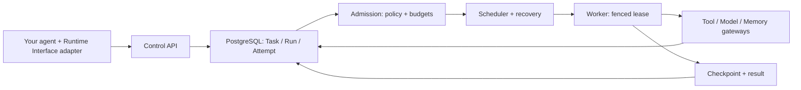

# Fenced

**The OS kernel for AI agents. Every agent runs fenced.**

Fenced (formerly AgentOS) manages the execution around your agent code: it stores
task state in PostgreSQL, places work on runtime pools, recovers after worker lease loss, and
rejects writes from stale workers. Gateways authorize and meter tool and model
calls against task budgets.

Use it when your agent tasks need to survive worker failures, coordinate through
durable mailboxes, or run with explicit execution budgets.

[Try locally](#try-locally) · [Recovery and fencing](#recovery-and-fencing) ·
[Architecture](#how-it-works) · [Current limits](#current-limits) ·
[中文使用指南](docs/user-guide.md)

[Apache 2.0](LICENSE) · [Source version: 1.3.0](CHANGELOG.md#130---2026-10-01) ·
[v1.2 public contract freeze](docs/contracts/v1.2-contract-freeze.md)

## Try locally

Start with a dependency-free Python agent and the Runtime Interface conformance
suite. You need **Go 1.26.x** and **Python 3.11+**. This trial needs no Docker,
model account, API key, or framework installation.

**Naming note:** Fenced was previously named AgentOS. The repository, CLI
binaries, SDK package names, Go module path, and protocol identifiers have all
been renamed to `Fenced` / `fenced`. Historical documents and released artifacts
may still reference the former name; see [docs/NAMING.md](docs/NAMING.md) for the
complete migration map and compatibility notes.

```shell
git clone https://github.com/CloudEdgeCore/Fenced.git Fenced
cd Fenced
```

**PowerShell:**

```powershell
$env:PYTHONPATH = "./sdk/python"
go run ./cmd/fenced-conformance -cmd "python examples/agents/python_remote/server.py --port 0" -timeout 30s
```

**Bash / zsh:**

```bash
PYTHONPATH=./sdk/python go run ./cmd/fenced-conformance -cmd "python3 examples/agents/python_remote/server.py --port 0" -timeout 30s
```

The command starts a local adapter, discovers its port, checks the protocol,
and stops the adapter when finished. The first Go build downloads dependencies.

Expected output includes:

```text
Adapter:  python-remote
Protocol: fenced.runtime.interface/v1
...
Fenced Compatible = PASS
```

**What this checks:** startup, idempotency, events, checkpoint/restore, result,
stop, and capability denial at the Runtime Interface boundary.

**Scope:** the example uses an EchoAgent and in-memory checkpoints. This is a
protocol smoke test; it does not exercise the PostgreSQL task kernel, real model
calls, durable recovery, or sandbox isolation.

To run the complete local platform, follow the
[control-plane setup](docs/development.md#start-the-local-control-plane).

## Recovery and fencing

When recovery retries a task after worker lease loss, it creates a replacement
attempt with a higher fencing token. Calls carrying the expired identity are
rejected before they can update durable task state.

[Reproduce the takeover check](docs/development.md#reproduce-a-takeover) with
Go and a disposable PostgreSQL instance; no model or API key is needed. It
deliberately expires a lease, invokes recovery, and verifies that:

1. The replacement receives a higher fencing token.
2. The old identity cannot heartbeat, commit a checkpoint, change phase, or
   read its assignment.
3. No stale checkpoint reaches PostgreSQL.

The check uses real storage and the Runtime Control service. It injects lease
expiry directly; it does not kill a deployed worker process.

For a broader deterministic workload, the
[research workflow takeover report](docs/evidence/multiruntime-takeover-2026-09-14.md)
describes worker loss and replacement across runtime pools, with commands and
the boundaries of that experiment.

## How it works



Publish an immutable agent version, submit a task, and let admission and the
scheduler select a runtime pool. Workers execute through Runtime Protocol v1;
gateways enforce authorization and usage accounting on calls routed through
them. Replacement workers can resume compatible checkpoints.

See the [architecture](docs/architecture/ARCHITECTURE.md) and
[framework integration guide](docs/ecosystem/README.md) for the full design.

## What is available

| Capability | What it does |
| --- | --- |
| Task kernel | Durable Task / Run / Attempt state machines, immutable agent versions, retries, checkpoints, and audited transitions |
| Scheduling and recovery | Capacity reservations, ranked placement, worker leases, monotonic fencing, and recovery after lease expiry |
| Execution governance | Token, cost, and tool-call budgets, deadlines, and runtime-specific resource limits |
| Durable IPC | At-least-once mailbox delivery, receiver deduplication receipts, and tenant-scoped access |
| Task-backed services | Supervised replicas, restart policies, rolling version convergence, and cooperative drain |
| Runtime integration | Reference and HTTP adapter workers, Wasmtime and OCI/gVisor providers, and Go/Python/TypeScript SDKs |

Framework adapters include LangGraph, AutoGen, CrewAI, OpenAI Agents, and custom
agents. Start with the [ecosystem guide](docs/ecosystem/README.md); use the
[conformance suite](conformance/README.md) to check an adapter's Runtime Interface
compatibility.

For services, supply a published `spec.agentVersionRef` and `spec.workloadSpec`
(`fenced service create -spec task-spec.json`), and apply migration `000037`.
Each replica consumes a real worker slot and retains Task budgets and timeouts.
See the [service guide](docs/user-guide.md#71-服务注册与启动).

## Current limits

- **CLI-first operation.** The web workbench is an internal, loopback-only
  preview; a production administration console and managed hosting are pending.
- **Infrastructure you operate.** The full platform uses PostgreSQL and NATS.
  Production paths require configured HTTPS/OIDC and SPIFFE mTLS identities;
  model, tool, embedding, and secret services need their own configuration.
- **Fencing protects ownership.** It rejects stale kernel operations. Physical
  isolation depends on the runtime, such as Wasmtime or OCI/gVisor; the reference
  provider is development infrastructure.
- **Cancellation is cooperative; attempts are non-preemptible.** Workers must
  acknowledge cancellation. Checkpoint recovery requires compatible agent
  versions, runtime ABIs, and state schemas.
- **Resource controls use different mechanisms.** Gateway budgets, scheduling
  capacity, and sandbox limits have different enforcement points. Calls that
  bypass the gateways are outside their usage accounting.
- **Frozen contracts have implementation boundaries.** Syscall ABI 1.0.0 defines
  21 calls across eight groups. Production gateway entry points currently
  register Tool, Model, Memory, and IPC services; unified Syscall and Effect
  endpoints are not yet wired into those entry points.

See the [feature status matrix](docs/feature-status.md) and
[production setup](docs/development.md#production-security-baseline) before deployment.

## Evidence and compatibility

| Evidence | Scope |
| --- | --- |
| [Runtime conformance checks](conformance/README.md) | Black-box Runtime Interface compatibility checks |
| [Recovery and fencing test](internal/security/negative_integration_test.go) | PostgreSQL lease takeover and rejection of stale identities |
| [TLA+ model](modelcheck/tla/README.md) | Finite-model checks of v0.1 core safety and liveness invariants |
| [100K report](docs/evidence/benchmark/100k-stability-2026-09-15.md) and [1M report](docs/evidence/benchmark/1m-2026-09-16.md) | Fixed-host control-plane pipeline measurements with raw logs; not real-agent or production throughput figures |

Reproducible raw 72h/7d production soak evidence is not yet published. The
[existing soak report](docs/evidence/soak-process-system-72h-7d.md) does not include
the raw logs and run metadata needed to substantiate those duration claims.

The [v1.2 contract freeze](docs/contracts/v1.2-contract-freeze.md) documents stable
Runtime, Gateway, Control API, Service, IPC, Effect, and Syscall contracts.
Breaking changes require a new contract version. Legacy `v1alpha1` compatibility
will not close before **2027-02-17**; see the
[compatibility policy](api/compatibility/v1alpha1-to-v1.json).

## Documentation

- [User guide / 中文使用指南](docs/user-guide.md): manifests, tasks, workflows, services, and CLI usage.
- [Development reference](docs/development.md): full local setup, observability, validation commands, and release verification.
- [Frameworks and runtimes](docs/ecosystem/README.md): adapters, providers, SDKs, and reference applications.
- [Helm deployment](deploy/helm/fenced/README.md): production HTTPS, OIDC, and Secret configuration.
- [Naming and migration](docs/NAMING.md) and [compatibility](docs/COMPATIBILITY.md): the AgentOS → Fenced rename map, what a pre-rename deployment can keep doing, and what must be migrated.
- [Changelog](CHANGELOG.md) and [GitHub Releases](https://github.com/CloudEdgeCore/Fenced/releases): source changes and published assets.

## Try it and share feedback

Run the local trial and [open an issue](https://github.com/CloudEdgeCore/Fenced/issues)
with the first step that blocks you: your OS, the command, and the error output.
If you already run agent workloads, describe the failure or budget-control
problem you would want Fenced to handle.
