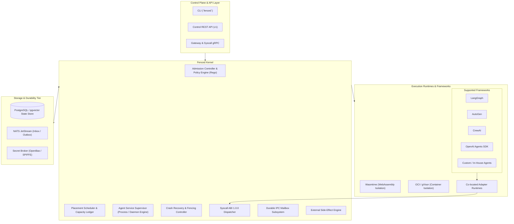

# Fenced Architecture Specification

This document provides the authoritative architectural blueprint for Fenced, the production operating system and control plane for autonomous AI agents.

---

## 1. High-Level Architectural Overview

Fenced abstracts the underlying compute, storage, communication, and model infrastructure into a unified kernel interface, separating untrusted agent logic from privileged operating system services.



---

## 2. Core Kernel Subsystems

### 2.1 Dual Execution Model: Task vs Daemon Service

Fenced is built around two complementary workload abstractions:

| Workload Type | Unit of Work | Lifecycle | Supervision Policy | Use Cases |
| :--- | :--- | :--- | :--- | :--- |
| **Task Workload** | `Task → Run → Attempt` | Run-to-completion (Ephemeral) | Exponential backoff retry, timeout, non-preemptible | Batch workflows, evaluations, asynchronous prompt pipelines, report generators |
| **Daemon Service** | `AgentService → ServiceInstance` | Long-running supervised process | Heartbeat TTL, auto-restart, rolling upgrade, drain | Interactive agents, event listeners, proactive monitor daemons, multi-agent mesh |

#### Task Lifecycle State Machine
```
           +--------------+
           |   SUBMITTED  |
           +-------+------+
                   |
                   v
           +--------------+
           |   SCHEDULED  |
           +-------+------+
                   |
                   v
+------> +--------------+ ----(Checkpoint)----+
|        |   RUNNING    |                     |
|        +-------+------+ <-------------------+
|                |
|         +------+------+-------------------------+
|         |             |                         |
|         v             v                         v
|   +-----------+ +-----------+            +--------------+
|   | COMPLETED | |  FAILED   |            | TIMED_OUT /  |
|   +-----------+ +-----+-----+            | CANCELLED    |
|                       |                  +--------------+
+----(Retry Attempt)----+
```

#### Daemon Service Supervision State Machine
```
 [PENDING] ---> [ACTIVE] <---> [DEGRADED]
                   |               |
                   +-------> [DRAINING] ---> [TERMINATED]
```

### 2.2 Syscall ABI 1.0.0

The Syscall ABI provides a strongly-typed, POSIX-modeled interface separating agent code from kernel implementation details. Runtimes perform system calls over standard gRPC or local Unix sockets using `SyscallRequest` and receive structured `SyscallResponse` envelopes.

- **Range 100–199 (Tool Subsystem)**: `sys_tool_invoke`, `sys_tool_list`. Enforces authorization, schema checking, and generates audit receipts.
- **Range 200–299 (Model Subsystem)**: `sys_model_invoke`, `sys_model_begin`, `sys_model_settle`, `sys_model_finish`. Governs LLM invocations with financial budget fences and rate limits.
- **Range 300–399 (Memory Subsystem)**: `sys_memory_put`, `sys_memory_search`. Tenant-scoped vector and associative memory operations.
- **Range 400–499 (IPC Subsystem)**: `sys_ipc_send`, `sys_ipc_receive`, `sys_ipc_ack`. Durable asynchronous mailbox messaging.
- **Range 500–599 (Runtime Subsystem)**: `sys_runtime_checkpoint`, `sys_runtime_complete`, `sys_runtime_yield`. Execution state persistence and cooperative scheduling.
- **Range 600–699 (Service Subsystem)**: `sys_service_heartbeat`, `sys_service_query`. Instance health monitoring and service discovery.
- **Range 700–799 (Resource Subsystem)**: `sys_namespace_get`, `sys_resource_quota_get`, `sys_resource_usage_get`. Resource accounting and quota inspection.
- **Range 800–899 (Effect Subsystem)**: `sys_effect_execute`, `sys_effect_get`. Fenced external mutation execution.

### 2.3 Durable IPC Mailbox Subsystem

The IPC Subsystem resolves inter-agent communication challenges across process and network boundaries:
1. **Addressing**: Target addresses bind to `AgentAddress { agent_version_ref, instance }`. The mailbox is anchored to the logical `Run`, allowing messages to survive attempt failures.
2. **At-Least-Once Delivery & Deduplication**: Messages are persisted in durable storage. Receivers track message IDs via mailbox receipts, ensuring exactly-once application semantics.
3. **Multi-Tenant Isolation**: Mailbox access is partitioned strictly by `tenant_id`. Cross-tenant delivery requires explicit federation policy.

### 2.4 External Side-Effect Engine

External side-effects (third-party API calls, transactions, webhooks) require transactional discipline:
1. **Monotonic Lease Fencing**: Every side-effect is stamped with the attempt's monotonic fencing token. Stale attempts are rejected (`SYSCALL_EFENCE`), preventing split-brain mutations.
2. **Idempotency Protection**: Payloads are hashed with SHA-256. Identical idempotency keys return existing receipts; payload mismatches are rejected (`SYSCALL_EINVAL`).
3. **Ambiguity Isolation (`UNKNOWN`)**: If an external provider connection drops or returns ambiguous results, the effect state transitions to `EFFECT_STATUS_UNKNOWN`. Runtimes and kernels are strictly prohibited from automatically replaying unknown side-effects.

---

## 3. High Availability, Self-Healing, and Soak Invariants

Fenced is verified under sustained continuous load and chaos conditions (manual/fixed-host 72-hour and 7-day soak tests completed; scheduled CI reproduction pending self-hosted runners; see [`docs/evidence/soak-process-system-72h-7d.md`](../evidence/soak-process-system-72h-7d.md)):
- **Zero Lost Tasks**: All tasks reliably reach a verified terminal phase (`COMPLETED`, `FAILED`, `CANCELLED`).
- **Zero Lost IPC Messages**: Every dispatched message is either acknowledged or available in the mailbox.
- **Monotonic Fencing Invariant**: Fencing tokens never regress under worker crashes or network partitions.
- **Leak-Free Operation**: Zero goroutine, memory, or database connection pool leakage across extended runtime cycles.
