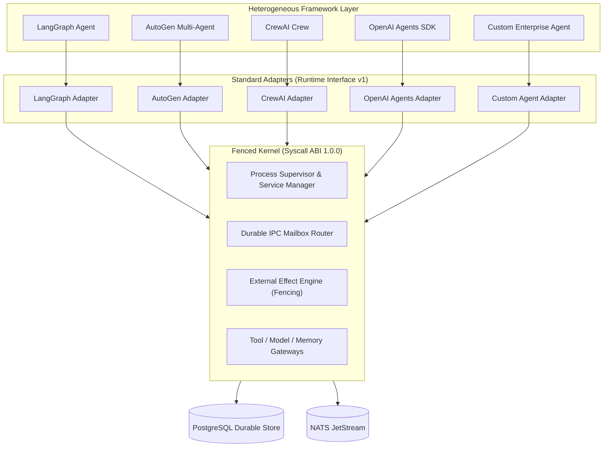
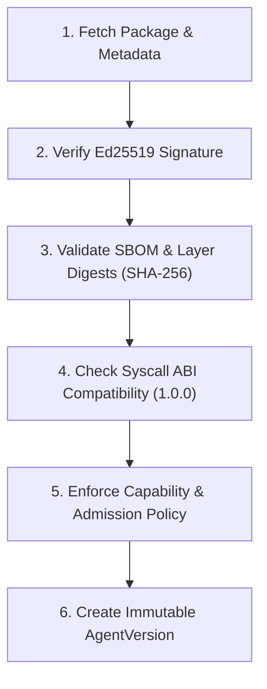

# Fenced Multi-Framework Ecosystem Guide

Fenced provides an unopinionated, operating-system-grade kernel for AI agents. Rather than forcing developers to rewrite existing agent logic into a proprietary DSL, Fenced allows agents built with **LangGraph**, **AutoGen**, **CrewAI**, **OpenAI Agents SDK**, and **In-House Custom Code** to run concurrently on the same unified kernel.

---

## 1. Why Run Agent Frameworks on Fenced?

While higher-level agent frameworks excel at prompt chaining, reasoning loops, and multi-agent dialog, production deployments quickly encounter severe operating-system-level challenges:

| Operational Challenge | Framework Alone | On Fenced Kernel |
| :--- | :--- | :--- |
| **Worker Process Crash** | State lost in memory; task fails permanently | **Supervisor Self-Healing**: Replacement instance spawned within TTL; state resumed from checkpoint |
| **Split-Brain Zombie Writes** | Network partitions cause duplicate side-effects | **Monotonic Lease Fencing**: Stale workers rejected with `SYSCALL_EFENCE` |
| **Cross-Framework Comms** | Incompatible proprietary message protocols | **Durable IPC Mailbox**: Standard asynchronous message passing with receiver deduplication |
| **External API Replays** | Timeouts cause double-charges or duplicate mutations | **Kernel Effect Engine**: Monotonic lease tokens, SHA-256 idempotency, non-replayable `UNKNOWN` |
| **Zero-Downtime Upgrades** | Service interruption during code deployments | **Rolling Upgrades & Drain**: Enforced `max_surge`, `max_unavailable`, and active task draining |
| **Audit & Governance** | Ad-hoc text logging | **Cryptographic Audit Log**: Merkle-tree receipts for all tool, model, and effect operations |

---

## 2. Architecture: Frameworks on Fenced



---

## 3. Supported Framework Adapters

### 3.1 LangGraph

LangGraph compiles graph-based state machines. The Fenced LangGraph adapter binds graph state transitions directly to Kernel checkpoints and durable task lifecycle.

- **Adapter**: [`adapters/langgraph/fenced_langgraph.py`](../../adapters/langgraph/fenced_langgraph.py)
- **Reference Server**: [`examples/agents/langgraph/server.py`](../../examples/agents/langgraph/server.py)
- **Execution**:
  ```bash
  python examples/agents/langgraph/server.py --port 8089
  ```
- **Key Capabilities**:
  - `on_start()` initializes graph state from task input payload.
  - State transitions trigger `fenced_checkpoint()` preserving intermediate node outputs.
  - Graph failures trigger supervisor restart and checkpoint resumption.

### 3.2 AutoGen

AutoGen models collaborative multi-agent conversations. On Fenced, agent conversations are decoupled from single-process memory and routed through the durable Kernel IPC Mailbox.

- **Adapter**: [`adapters/autogen/fenced_autogen.py`](../../adapters/autogen/fenced_autogen.py)
- **Reference Server**: [`examples/agents/autogen/server.py`](../../examples/agents/autogen/server.py)
- **Execution**:
  ```bash
  python examples/agents/autogen/server.py --port 8090
  ```
- **Key Capabilities**:
  - ConversableAgents send messages via `SYS_IPC_SEND` (`401`).
  - Worker processes poll incoming messages via `SYS_IPC_RECEIVE` (`402`) with correlation ID tracking.
  - Messages persist across agent instance restarts.

### 3.3 CrewAI

CrewAI orchestrates autonomous role-playing crews and tasks. On Fenced, Crews run as managed **`AgentService` Daemons** with continuous health checks and auto-reaping.

- **Adapter**: [`adapters/crewai/fenced_crewai.py`](../../adapters/crewai/fenced_crewai.py)
- **Reference Server**: [`examples/agents/crewai/server.py`](../../examples/agents/crewai/server.py)
- **Execution**:
  ```bash
  python examples/agents/crewai/server.py --port 8091
  ```
- **Key Capabilities**:
  - Continuous heartbeat emission to Supervisor (`SYS_SERVICE_HEARTBEAT`).
  - Zero-downtime rolling upgrades when updating crew definitions.
  - Graceful instance draining: finishing current crew task before pod replacement.

### 3.4 OpenAI Agents SDK

The OpenAI Agents SDK provides agent primitives, handoffs, and tool execution. On Fenced, tools and LLM invocations pass through the Kernel Gateways for quota enforcement and auditability.

- **Adapter**: [`adapters/openai_agents/fenced_openai_agents.py`](../../adapters/openai_agents/fenced_openai_agents.py)
- **Reference Server**: [`examples/agents/openai_agents/server.py`](../../examples/agents/openai_agents/server.py)
- **Execution**:
  ```bash
  python examples/agents/openai_agents/server.py --port 8092
  ```
- **Key Capabilities**:
  - Agent handoffs trigger `AgentAddress` mailbox routing.
  - Function tool calls invoke `SYS_TOOL_INVOKE` (`101`) behind default-deny policy.
  - Token consumption reconciled incrementally via `SYS_MODEL_SETTLE` (`203`).

### 3.5 Custom Enterprise Agents

For proprietary in-house agents built in Python, Go, or Rust:

- **Adapter**: [`adapters/custom_agent/fenced_custom.py`](../../adapters/custom_agent/fenced_custom.py)
- **Reference Server**: [`examples/agents/custom/server.py`](../../examples/agents/custom/server.py)
- **Execution**:
  ```bash
  python examples/agents/custom/server.py --port 8093
  ```

---

## 4. Proving Compatibility: Conformance Suite

Any framework adapter or custom runtime can certify its compatibility with Fenced using the single-command Conformance Suite:

```bash
# 1. Start your framework adapter server
python examples/agents/langgraph/server.py --port 8089

# 2. Run the conformance suite
fenced conformance -endpoint http://127.0.0.1:8089
```

Or let the conformance tool auto-spawn and discover your server:

```bash
fenced-conformance -cmd "python examples/agents/crewai/server.py --port 0"
```

A compliant runtime produces the certification signature:
```text
--------------------------------------------------
Fenced Compatible = PASS
--------------------------------------------------
```

---

## 5. End-to-End Multi-Framework Integration Test

To verify all 5 frameworks running simultaneously on a single Fenced Kernel, run the integration test:

```bash
go test -v -run TestEcosystem_MultiFramework_CoexistenceAndRecovery ./internal/kernel/supervisor
```

This test:
1. Deploys 5 distinct framework services (`LangGraph`, `AutoGen`, `CrewAI`, `OpenAI Agents`, `Custom Agent`) on the same kernel (10 total instances).
2. Transmits cross-framework messages via the Kernel Durable Mailbox.
3. Dispatches guarded side-effects with monotonic fencing tokens.
4. Injects SIGKILL faults into running instances and verifies supervisor auto-recovery with **zero lost tasks and zero lost messages**.

---

## 6. Unified Provider SDK (Go & Python)

The Fenced Provider SDK allows external hardware, models, browser engines, and databases to be plugged into Fenced **without modifying the Kernel**.

### 6.1 Provider Categories
1. **`ModelProvider`**: Chat completions, function/tool calling, and streaming sessions (`sdk/provider/model.go`).
2. **`ToolProvider`**: Custom capability tools, parameter validation, and cryptographic audit receipts (`sdk/provider/tool.go`).
3. **`MemoryProvider`**: Key-value persistence and pgvector semantic vector search (`sdk/provider/memory.go`).
4. **`BrowserProvider`**: Headless browser automation (navigate, screenshot, click, evaluate) (`sdk/provider/browser.go`).
5. **`StorageProvider`**: Blob and artifact storage (`sdk/provider/storage.go`).
6. **`RuntimeProvider`**: Sandbox and container isolation management (`sdk/provider/runtime.go`).

### 6.2 Provider Metadata Contract
Every Provider must declare:
```json
{
  "name": "openai-provider",
  "version": "1.0.0",
  "type": "model",
  "capabilities": ["model:generate", "model:stream", "model:tools"],
  "configSchema": { "type": "object", "required": ["apiKey"] },
  "secrets": ["OPENAI_API_KEY"],
  "health": { "status": "HEALTHY" },
  "resourceRequirements": { "cpu": "100m", "memory": "128Mi" }
}
```

### 6.3 Reference Providers
- **`OpenAIProvider`**: [`sdk/provider/openai.go`](../../sdk/provider/openai.go)
- **`BrowserProvider`**: [`sdk/provider/browser_ref.go`](../../sdk/provider/browser_ref.go)
- **`PostgresMemoryProvider`**: [`sdk/provider/postgres_memory.go`](../../sdk/provider/postgres_memory.go)

---

## 7. Third-Party Runtime SDK

Based on `fenced.runtime.interface/v1`, third-party runtimes only need to implement 7 lifecycle hooks:
`health` / `start` / `event` / `result` / `checkpoint` / `restore` / `stop`.

### 7.1 Developer Workflow
```bash
# 1. Scaffold a new runtime
fenced runtime init my-runtime --template docker

# 2. Start the runtime server
cd my-runtime && go run .

# 3. Test conformance certification
fenced runtime test http://127.0.0.1:8088
# Output: Fenced Compatible = PASS
```

### 7.2 Official Reference Runtimes
1. **Docker Runtime**: [`examples/runtimes/docker-runtime`](../../examples/runtimes/docker-runtime) — Container isolation, volume-backed checkpoints.
2. **Python Runtime**: [`examples/runtimes/python-runtime`](../../examples/runtimes/python-runtime) — Native Python runtime using `fenced_runtime.serve`.
3. **Remote HTTP Runtime**: [`examples/runtimes/remote-http-runtime`](../../examples/runtimes/remote-http-runtime) — Universal webhook proxy for distributed microservices.

---

## 8. Agent Package Registry & Security Verification Pipeline

Fenced packages are distributed via OCI registries with signed metadata indexes (`fenced.agentpkg/v1`).

### 8.1 Package Metadata Fields
- `manifest`: Full agent manifest JSON (`fenced.dev/v1`)
- `version`: Semver version
- `oci_digest`: SHA-256 layer hash (`sha256:...`)
- `signature`: Ed25519 signature & Key ID
- `sbom`: CycloneDX SBOM digest
- `syscall_abi_version`: Syscall ABI version (`1.0.0`)
- `capabilities`: Requested capabilities
- `runtime_requirements`: CPU, memory, isolation class
- `publisher`: ID, name, verified status
- `compatibility`: Min kernel version rule

### 8.2 Developer CLI
```bash
fenced login -registry https://registry.fenced.dev -token $REGISTRY_TOKEN
fenced package build -manifest agent.json -out package.json
fenced package sign -package package.json -key-id publisher-key -private-key $PRIV_KEY
fenced package push -package package.signed.json
fenced package search "sre"
fenced package verify -package package.signed.json -public-key $PUB_KEY
fenced package install -package package.signed.json -tenant prod
```

### 8.3 Mandatory 6-Stage Security Pipeline


**Security Invariant**: It is physically impossible for any package from the registry to bypass Admission, Capability grants, or Policy rules. Any failure immediately aborts installation with explicit failure causes.
