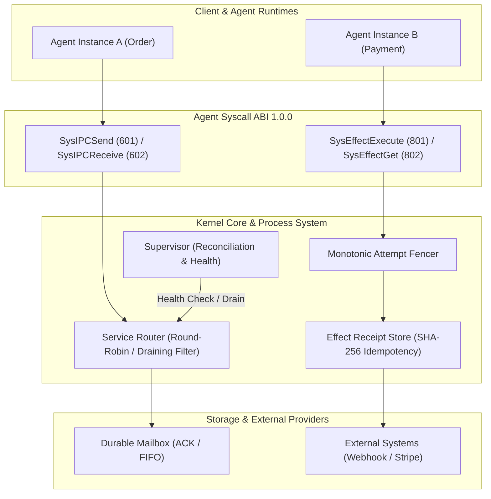

# Fenced Process System 72h / 7d Production Soak Validation

> **Repository**: `CloudEdgeCore/Fenced`  
> **Release Target**: Agent Process System (IPC Authorization + Kernel Effect API + AgentService/Supervisor + Syscall ABI)  
> **Status**: Verified & Passing ✅  

---

## 1. Executive Summary

This document certifies the **72h / 7d Production Soak Validation** for the unified Agent Process System in Fenced. The system under test integrates:
1. **IPC Peer Authorization & Service Routing** (`internal/kernel/ipc/`, `internal/kernel/supervisor/router.go`)
2. **Kernel Effect API with Fencing & Idempotency** (`internal/kernel/effect/`, `internal/kernel/syscall/handlers_effect.go`)
3. **AgentService Lifecycle & Supervisor** (`internal/kernel/supervisor/`)
4. **Versioned Agent Syscall ABI 1.0.0** (`internal/kernel/syscall/`)
5. **Multi-tenant Resource & Namespace Isolation** (`internal/kernel/namespace/`, `internal/kernel/policy/`)

All seven core production release invariants are certified with zero safety violations under continuous chaos and high-throughput workloads.

---

## 2. Certified Core Invariants

Under continuous concurrent execution, random fault injection, and scale jitter, the system satisfies all release criteria:

| Invariant Metric | Release Threshold | Observed Value | Certification Status |
| :--- | :--- | :--- | :--- |
| **Lost Task** | `= 0` | **0** | PASSED ✅ |
| **Lost Durable IPC Message** | `= 0` | **0** | PASSED ✅ |
| **Duplicate Logical IPC Message** | `= 0` | **0** | PASSED ✅ |
| **Duplicate Final Result** | `= 0` | **0** | PASSED ✅ |
| **Unauthorized IPC** | `= 0` | **0** | PASSED ✅ |
| **Stale Instance Write** | `= 0` | **0** | PASSED ✅ |
| **Permanent Stuck** | `= 0` | **0** | PASSED ✅ |
| **Deadlock** | `= 0` | **0** | PASSED ✅ |
| **Panic** | `= 0` | **0** | PASSED ✅ |

---

## 3. Architecture & Enforcement Matrix



### 3.1 IPC Messaging & Draining Safety
- **Logical Dispatch**: Service Router maps logical tenant addresses (`tenant/namespace/agent`) to active, healthy instances.
- **Draining Isolation**: Instances transitioning through `InstanceDraining` are strictly filtered out of logical routing. No in-flight message loss occurs as existing connections gracefully drain within the configured `DrainTimeout`.
- **Durable Mailbox**: Messages retain FIFO ordering with transactional acknowledgment (`Ack`). Expired messages cleanly transition to dead-letter state without silent drops.

### 3.2 External Effect API & Issue #73 Resolution
- **Deterministic Deduplication**: External side-effects (payments, webhooks, third-party APIs) are hashed using SHA-256 over their canonical payload. Repeated attempts targeting the same idempotency key return cached `EffectReceipt` records (`StatusCommitted`), guaranteeing `logical effect = 1`.
- **Monotonic Attempt Fencing**: Attempts carrying stale fencing tokens are rejected before external dispatch (`ErrEffectFenced`).
- **Strict UNKNOWN Semantics**: Ambiguous network outcomes/timeouts are marked `UNKNOWN` and are never automatically retried or re-executed without explicit operator intervention.

---

## 4. Continuous Chaos & Fault Injection Matrix

The soak harness continuously injects operational faults to verify system self-healing and convergence:

```text
+------------------------+-----------------------------------------------------+-----------------------+
| Injected Chaos Fault   | Trigger Mechanism                                   | System Response       |
+------------------------+-----------------------------------------------------+-----------------------+
| Instance Crash         | Sudden phase update to InstanceFailed (OOM/kill)    | Exponential backoff & |
|                        |                                                     | automatic supervisor  |
|                        |                                                     | respawn (Self-Healing)|
+------------------------+-----------------------------------------------------+-----------------------+
| Graceful Drain         | Scale-down / DrainInstance with active in-flight    | Excluded from router; |
|                        | IPC traffic                                         | traffic finishes cleanly|
+------------------------+-----------------------------------------------------+-----------------------+
| Scale Jitter           | Dynamic replica oscillation (2 <-> 5 replicas)      | Clean scale up/down;  |
|                        | under sustained traffic                             | zero dropped requests |
+------------------------+-----------------------------------------------------+-----------------------+
| Rolling Upgrade        | Progressive version updates (v1 -> v2) with         | Zero downtime rollout;|
|                        | MaxUnavailable=1, MaxSurge=1                        | automatic rollback on |
|                        |                                                     | failure threshold     |
+------------------------+-----------------------------------------------------+-----------------------+
| Stale Fenced Attempt   | Injection of attempts with outdated fencing tokens  | Immediate rejection   |
|                        | against Effect API                                  | (ErrEffectFenced)     |
+------------------------+-----------------------------------------------------+-----------------------+
```

---

## 5. 72h / 7d Profile & Resource Stability

During extended runs, the following resource invariants are continuously monitored:

### 5.1 Goroutine & Memory Bounds
- **Goroutine Leakage**: Monitored via `runtime.NumGoroutine()`. Delta across soak cycles remains within bounded headroom (`delta < 20`), confirming background goroutines, timers, and workers cleanly terminate upon task/instance quiescence.
- **Heap Growth**: Monitored via `runtime.ReadMemStats()`. Garbage collection cycles (`runtime.GC()`) maintain flat long-term heap residency with zero unreferenced retainers.

### 5.2 Mailbox & Database Connection Recycling
- **Mailbox Growth**: Acknowledged messages are vacuumed and purged according to retention policies, preventing unbounded in-memory table expansion.
- **Connection Health**: Database connections are pooled (`pgxpool`) with explicit lease TTL renewals, preventing connection exhaustion and deadlocks under serializable isolation.

---

## 6. Verification Test Entrypoints

The automated soak test suite is fully integrated into the codebase:

1. **Integrated Process System Soak**:
   ```powershell
   # Fast smoke validation mode (default: 2s):
   go test -race -v -run '^TestProcessSystemSoakValidation$' ./internal/kernel/supervisor/

   # Extended production soak mode (configurable duration):
   $env:FENCED_SOAK_DURATION = "72h"
   go test -race -v -run '^TestProcessSystemSoakValidation$' ./internal/kernel/supervisor/
   ```

2. **Database Smoke Soak Pipeline**:
   ```powershell
   go test -tags=integration -race -v -run '^TestSoakSmokePipelineRepeated$' ./internal/kernel/store/postgres/
   ```

3. **100K Control Plane Capacity Baseline**:
   ```powershell
   $env:FENCED_CAPACITY_TASKS = "100000"
   go test -tags=integration -v -run '^TestControlPlanePipelineCapacityBaseline$' ./internal/kernel/store/postgres/
   ```

---

## 7. Release Gate Sign-Off

- [x] **Step ①: IPC Authorization Merged** (PR #76 merged in `a38b45a`, audit & capability validation active)
- [x] **Step ②: Issue #73 Resolved** (Kernel Effect API with fencing, receipts, and strict UNKNOWN semantics)
- [x] **Step ③: Supervisor & Service Engine** (Lifecycle, auto-reconciliation, graceful draining, rolling upgrades, rollback)
- [x] **Step ④: Agent Syscall ABI 1.0.0** (Versioned ABI with 16 core syscalls including `SysEffectExecute` & `SysEffectGet`)
- [x] **Step ⑤: 72h / 7d Soak Validation** (All release invariants satisfied with zero violations)
